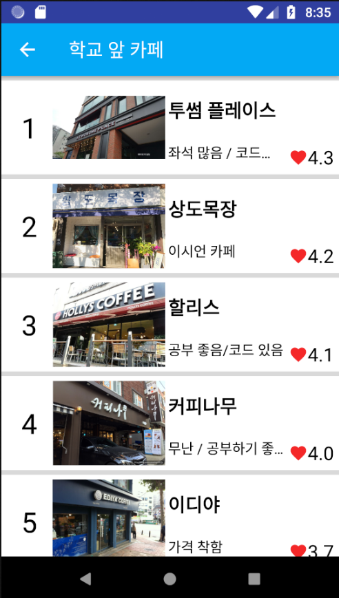

# 'What Should Eat Today?', College Students' Restaurant Recommendation Application
 - This is the program that recommends restaurants with 'profile card' to college students.
 - https://console.firebase.google.com/u/1/project/whattoeattoday-8d99f/overview

## Usage
### 1) Login
 
 - You can login with this app account, facebook account and google account.
 - You can sign up with a bottom button.

 
 - Login information records on Firebase Authorization.

### 2) Home Screen 
 
 - This is a home screen of 'What Should Eat Today?'.
 - "밥팅(Bobting)": You can get recommended restaurant with 'Recommendation Algorithm'.
 - "이 주의 학식(This week's school food)": You can see this week's school food menu.
 - "학교 앞 카페(Nearby cafes)": You can see the rank of nearby cafes.
 - "학교 앞 술집(Nearby bars)": You can see the rank of nearby bars.

### 3) "밥팅(Bobting)"
 - Main service of this application.

 
 - "추천 밥팅(Recommendation Bobting)": recommendation based on records
 - "랜덤 밥팅(Random Bobting)": ranodm recommendation

 
 - You can get 'profile card' of restaurants' that summarizes the photo, location, and food category.

 
 - If you press 'Go' button, after one hour, you will receive survey message.

 
 - All process records on Firebase Realtime Database.

### 4) Restaurant Community

 
 - There is sidebar on home screen.

 
 - If you press "전체식당 랭킹" button, you can see the restaurants' rank.

 
 - Each restaurant, you can see more details, when you press it.

 
 - Users can review each restaurant and give 0~5 hearts.

### 5) "학교 앞 카페(Nearby Cafe)"
 
 - You can see the rank of nearby cafes.

### 6) "학교 앞 술집(Nearby bars)"
 
 - You can see the rank of nearby bars.
